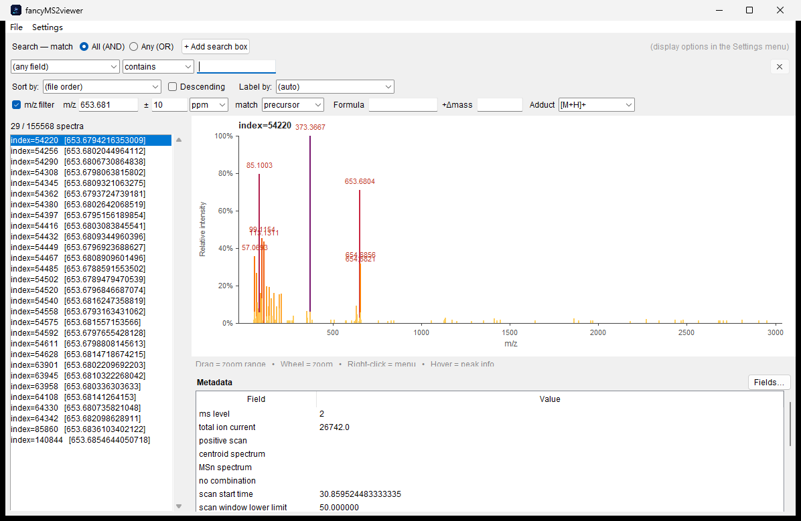
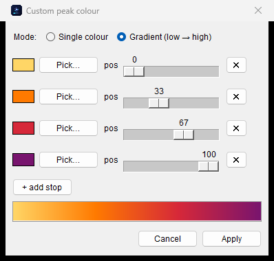
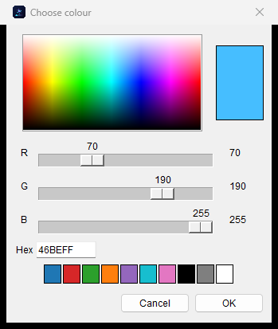
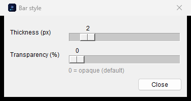
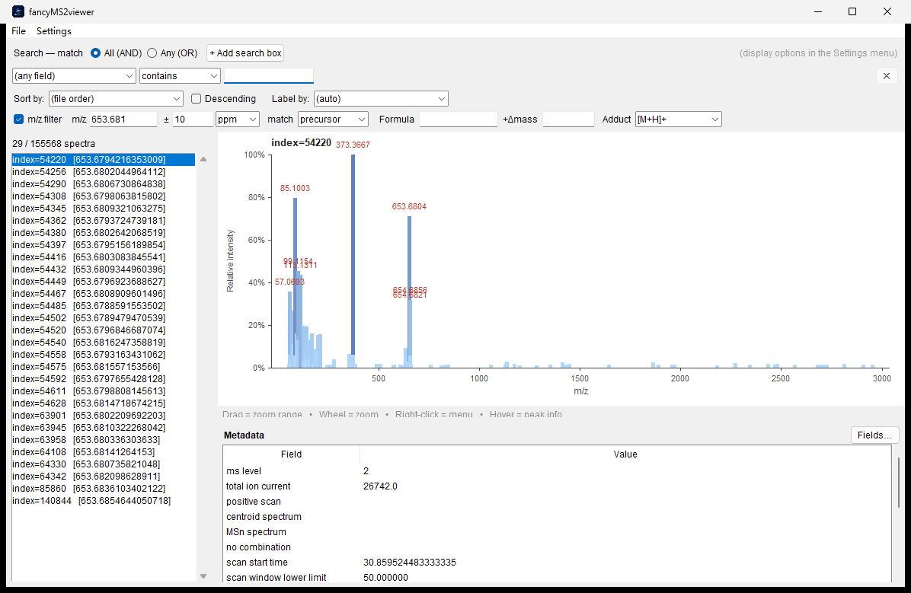

<p align="center">
  
</p>

<h1 align="center">FancyMS2Viewer</h1>

<p align="center">
  A fast, lightweight desktop viewer for MS/MS (MS2) spectral libraries —
  browse, search, filter, recolour and export tandem mass spectra.
</p>

<p align="center">
  <em>Reads <code>.msp</code>, <code>.mgf</code> and <code>.mzML</code> · handles multi-GB files · zero install on Windows</em>
</p>

> ⚠️ **Built entirely by AI.** Every line of code, the icon, and this README were
> written by Anthropic's **Claude** (via Claude Code) through an iterative
> conversation. It is shared as a practical demonstration of AI-assisted
> software development. Please review before relying on it for critical work.

---

## Screenshot

The main window — spectrum list, interactive stick plot, and metadata panel.
Here a **2.98 GB Bruker timsTOF `.mzML`** (165,768 scans → **155,568 MS2**, MS1
skipped) has streamed in about **18 s**, and the **m/z filter** has narrowed it
to the **29** precursors matching **653.681 ± 10 ppm**:



---

## Features

### Formats & performance
- Reads **`.msp`** (NIST), **`.mgf`** (Mascot Generic Format) and **`.mzML`**
  (including `.gz`); format is auto-detected.
- **Streaming background load** — spectra appear as they are parsed, so you can
  start browsing within a fraction of a second while a **progress bar** runs in
  the status bar. The UI never freezes.
- Tuned for **very large mzML** (multi-GB timsTOF/Orbitrap runs): **MS1 scans
  are skipped** without decoding, peaks are stored in compact arrays, and
  strings are interned — a ~3 GB / 165k-spectrum file loads in seconds with
  modest memory.
- Load several files at once; drag-and-drop files onto the window.

### Browse, search & filter
- Spectrum list with a configurable **label field** and **numeric-aware sorting**
  (by any field, name, or peak count; ascending/descending).
- **Multiple search boxes** combined with **All (AND)** / **Any (OR)**; each box
  matches a field by *contains* (text), *range*, or *value ± tolerance* (numeric).
- **m/z filter** against the **precursor** or **any fragment peak**, with a
  tolerance in **ppm or Da**. Enter an m/z directly, or compute it from a
  **chemical formula + adduct type** (monoisotopic) plus an optional extra Δmass.
- **Metadata panel** with a field chooser to show/hide individual fields.

### Plot
- Interactive stick plot: **drag to zoom** a range, **wheel to zoom**, **hover**
  for exact m/z & intensity, top peaks labelled.
- **Right-click menu** on the plot to reset zoom or export.
- Toggle **relative (%)** vs **absolute** intensity.

### Appearance
- Peak colour **schemes** (Ocean, Viridis, Magma, Sunset, …) plus a fully
  **custom single colour or gradient** with a colour palette and draggable stop
  positions.
- Adjustable **bar thickness** and **transparency**.
- Text renders in **Arial** (Latin) and **Microsoft YaHei** (Chinese); both are
  embedded as subsets in exported PDFs.

### Export
- **Copy peaks to clipboard** as two columns (m/z + intensity) — paste straight
  into Excel.
- Save spectra to **`.msp`** or **`.mgf`** (a multi-spectrum selection goes into
  one file).
- Save the plot as **PNG** (raster) or **vector PDF** (one page per spectrum),
  at the current preview size or a custom width × height.
- **Right-click export** from the list or plot. To avoid accidental bulk work,
  image export is single-spectrum only; multi-selection can only be exported to
  a single `.msp`/`.mgf`.

---

## Colour & bar styling

The look of the peaks is fully configurable from the **Settings** menu, and the
same styling is applied to the on-screen plot **and** to PNG/PDF exports.

**Peak colour** — pick a preset scheme (Ocean, Viridis, Magma, Sunset, …) or
open *Custom colour / gradient…* to build your own. Choose **Single colour** or
**Gradient**; in gradient mode add up to 8 stops, choose each colour from the
built-in **palette / RGB / hex** picker, and **drag each stop's position**
(0–100 %). A live bar previews the result. Colours map to relative peak
intensity (low → high).

<p>
  
  
</p>

**Bar style** — *Bar style (thickness / transparency)…* sets stick **thickness**
(1–10 px) and **transparency** (0–95 %; `0` = opaque, the default). Transparency
blends toward the white background so the preview matches exports.

<p>
  
  
</p>

*(Left: the bar-style dialog. Right: the same spectrum with the Ocean scheme,
5 px bars at 35 % transparency.)*

---

## Getting started

### Windows (no install)
Download **`fancyMS2viewer.exe`** from the
[`dist/`](dist) folder (or the Releases page) and double-click it.
Everything is bundled — no Python required. First launch may take a couple of
seconds while the single-file executable unpacks.

You can also drag `.msp` / `.mgf` / `.mzML` files onto the window, or onto the
`.exe` icon.

### Run from source
```bash
python fancyMS2viewer.py            # then File → Open…
python fancyMS2viewer.py file.mzML  # open a file directly
```

**Requirements** (Python 3.9+):
- `tkinter` — standard library (ships with CPython on Windows/macOS)
- [`Pillow`](https://pypi.org/project/Pillow/) — PNG export
- [`reportlab`](https://pypi.org/project/reportlab/) — vector PDF export
- [`tkinterdnd2`](https://pypi.org/project/tkinterdnd2/) — *(optional)* drag-and-drop

```bash
pip install pillow reportlab tkinterdnd2
```
Missing optional packages degrade gracefully (e.g. no drag-and-drop, or a
raster-fallback PDF).

### Build the executable
```bash
pip install pyinstaller
pyinstaller --noconfirm --onefile --windowed \
  --icon icon.ico --add-data "icon.png;." \
  --name fancyMS2viewer fancyMS2viewer.py
```

---

## Notes & limitations
- By design the mzML reader keeps only **MS2 (and higher)** spectra; MS1 survey
  scans are skipped.
- Transparency is rendered by blending toward a white background (Tk canvas
  lines have no alpha channel), so the on-screen preview matches the exports.
- The native **Open/Save** file dialog is provided by the OS and appears in the
  system language; in-app dialogs are in English.
- Tested on Windows. The source is cross-platform, but the packaged `.exe` and
  the bundled fonts (Arial / Microsoft YaHei) are Windows-oriented.

---

## License
Released under the **GNU General Public License v3.0** — see [LICENSE](LICENSE).

---

<p align="center"><sub>Made with 🤖 by Claude (Anthropic) via Claude Code.</sub></p>
