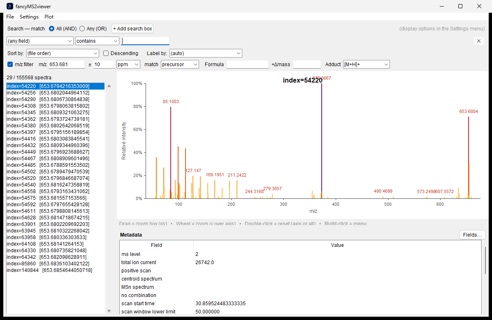
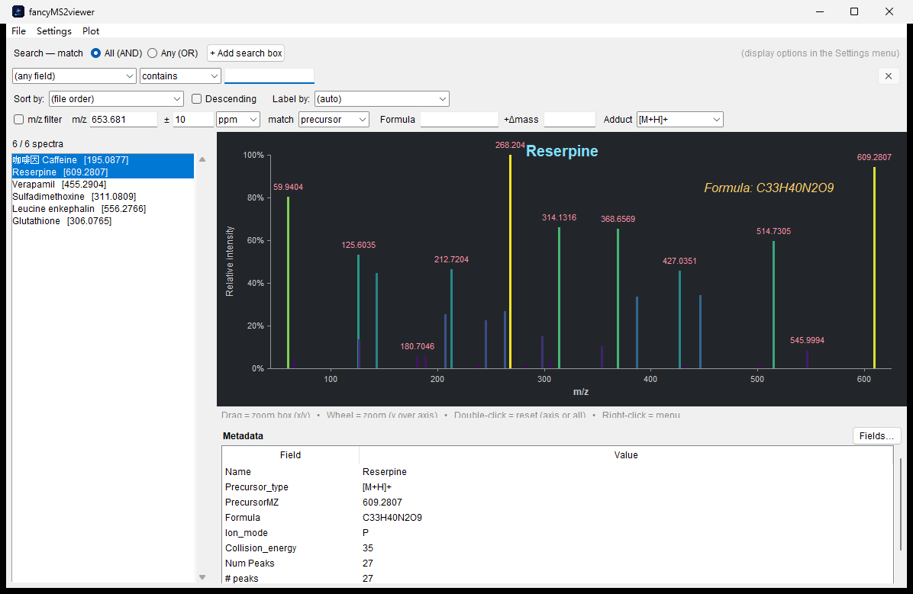
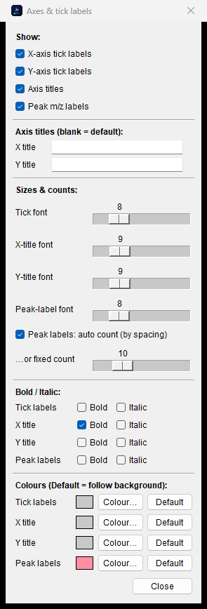
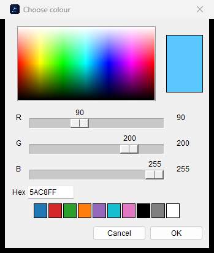
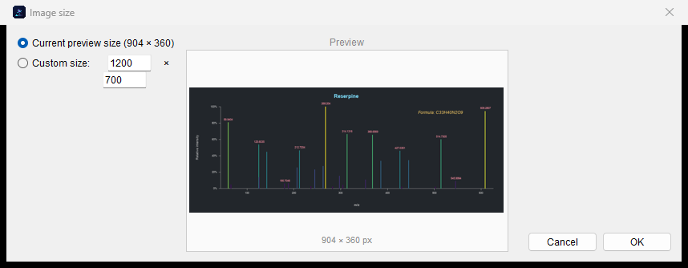

<p align="center">
  
</p>

<h1 align="center">fancyMS2viewer</h1>

<p align="center">
  A fast, publication-friendly desktop viewer for MS/MS (MS2) spectral
  libraries — browse, search, filter, richly style, and export tandem mass
  spectra.
</p>

<p align="center">
  <em>Reads <code>.msp</code>, <code>.mgf</code>, <code>.mzML</code> · handles multi-GB files · vector PDF export · zero install on Windows</em>
</p>

> ⚠️ **Built entirely by AI.** All of the code, the icon, and this README were
> written by Anthropic's **Claude** (via Claude Code) through an iterative
> conversation, as a demonstration of AI-assisted software development.
> Please review before relying on it for critical work.

---

## Screenshot

The main window on a **2.98 GB Bruker timsTOF `.mzML`** (165,768 scans →
**155,568 MS2** kept, MS1 skipped) — it streams in about **18 s** and stays
interactive. Here the **m/z filter** narrows it to the **29** precursors
matching **653.681 ± 10 ppm**:



Everything on the plot is styleable, on screen and in exports — background
theme, peak colours, draggable metadata labels, per-element fonts & colours:



---

## Features

### Formats & performance
- Reads **`.msp`** (NIST), **`.mgf`** (Mascot Generic Format) and **`.mzML`**
  (incl. `.gz`); format auto-detected.
- **Streaming background load** — spectra appear as they parse (progress in the
  status bar); the UI never freezes.
- Built for **very large mzML** (multi-GB timsTOF / Orbitrap): MS1 scans are
  skipped, peaks stored in compact arrays, strings interned.
- Open several files at once, or drag-and-drop onto the window.

### Browse, search & filter
- Spectrum list with a configurable **label field** and **numeric-aware sort**.
- **Multiple search boxes** combined with **All (AND)** / **Any (OR)**; each box
  matches a field by *contains* (text), *range*, or *value ± tolerance*.
- **m/z filter** on the **precursor** or **any fragment peak**, tolerance in
  **ppm or Da**. Type an m/z, or compute it from a **chemical formula + adduct**
  (monoisotopic mass) plus an optional extra Δmass.
- Default view limited to **precursor + 5 m/z** (toggleable).
- **Metadata panel** with a show/hide field chooser.

### Interactive plot
- Zoom **X and Y** — drag a box, or scroll the wheel (over an axis end it pins
  that end); **pan** by dragging the axes; double-click to reset one axis or
  all.
- Hover for exact m/z / intensity; the Y axis does not rescale when you zoom X.

### Styling — applied on screen *and* in every export
- **Peak colours**: preset schemes (Ocean, Viridis, Magma, Sunset, …) or a fully
  **custom single colour / multi-stop gradient** with a colour palette and
  **draggable stop positions**.
- Adjustable **bar thickness** and **transparency**.
- **Plot background** themes: White, Light grey, Sepia, Dark, Black.
- **Metadata labels on the plot** — add any field as *value only* or
  *Field: value*; **drag to move, wheel to resize, right-click / double-click**
  to edit; per-label **font size, bold, italic, colour**. They stay put across
  spectra and just update their values.
- **Axes & labels** — show/hide ticks, titles and peak labels; **editable X/Y
  titles**; **independent** per-axis title font size / bold / italic / colour;
  tick and peak-label font / bold / italic / colour; peak-label count auto
  (by spacing) or fixed.
- Toggle **relative (%)** vs **absolute** intensity.
- Text renders in **Arial** (Latin) and **Microsoft YaHei** (Chinese), with
  bold/italic, embedded as subsets in exported PDFs.

<p>
  
  
  
</p>

### Export
- **Copy peaks to clipboard** as two columns (m/z + intensity) — paste into Excel.
- Save spectra to **`.msp`** / **`.mgf`** (a multi-selection goes into one file).
- Save the plot as **PNG** (raster) or **vector PDF** (one page per spectrum),
  at the current preview size or a custom size — with a **live preview**:

<p>
  
</p>

- Right-click a spectrum (list) or the plot to export directly.

---

## Getting started

### Windows (no install)
Download **`fancyMS2viewer.exe`** (see the `dist/` folder or the Releases page)
and double-click it — everything is bundled, no Python needed. You can also drag
`.msp` / `.mgf` / `.mzML` files onto the window or the `.exe` icon.

### Run from source
```bash
python fancyMS2viewer.py            # then File → Open…
python fancyMS2viewer.py file.mzML  # open a file directly
```
**Requirements** (Python 3.9+): `tkinter` (stdlib) · `Pillow` (PNG) ·
`reportlab` (vector PDF) · `tkinterdnd2` *(optional, drag-and-drop)*.
```bash
pip install pillow reportlab tkinterdnd2
```
Missing optional packages degrade gracefully.

### Build the executable
```bash
pip install pyinstaller
pyinstaller --noconfirm --onefile --windowed \
  --icon icon.ico --add-data "icon.png;." \
  --name fancyMS2viewer fancyMS2viewer.py
```

---

## Notes
- The mzML reader keeps only **MS2 (and higher)** spectra; MS1 survey scans are
  skipped by design.
- Tested on Windows; the source is cross-platform, but the packaged `.exe` and
  the bundled fonts (Arial / Microsoft YaHei) are Windows-oriented.

## License
Released under the **GNU General Public License v3.0** — see [LICENSE](LICENSE).

---

<p align="center"><sub>Made with 🤖 by Claude (Anthropic) via Claude Code.</sub></p>
